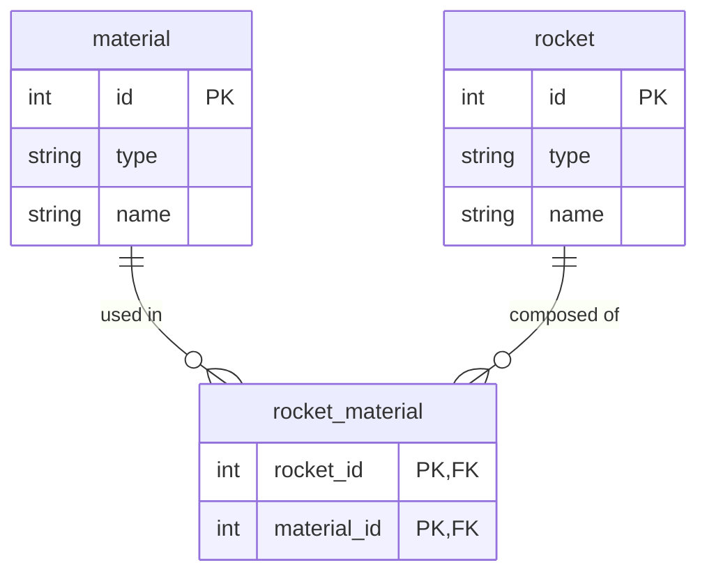
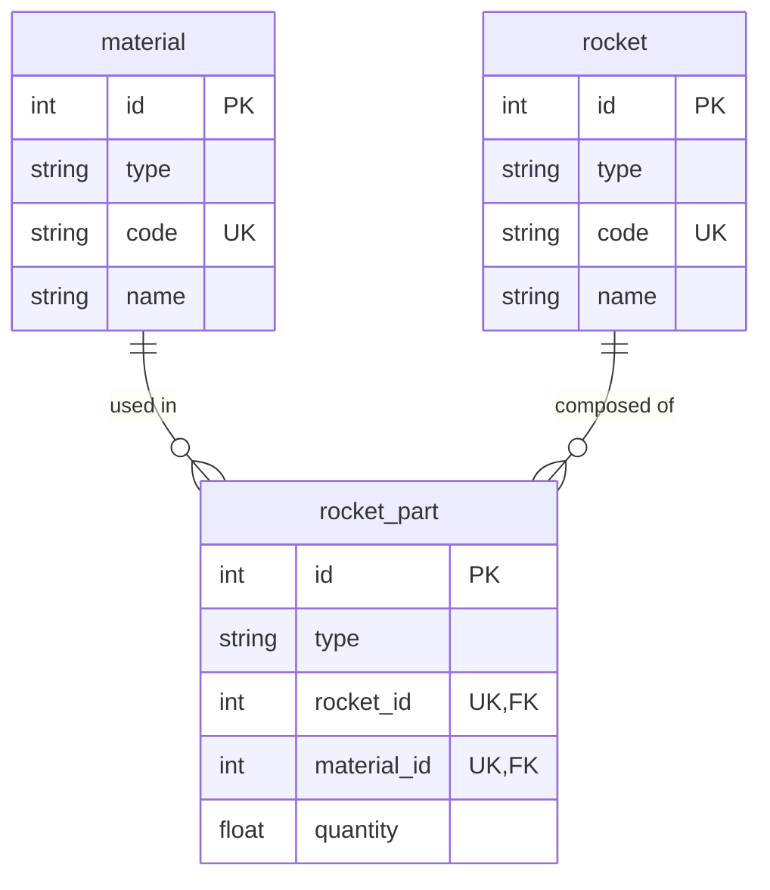

# Why use Plateforme?

**Plateforme** lets you build powerful data-driven applications and services with minimal effort. Its resource-centric architecture features a natural, intuitive syntax that prioritizes developer experience, enabling extremely fast prototyping while maintaining extensive customization options, high performance and scalability.

Unlike traditional frameworks that require piecing together multiple components, Plateforme unifies your data models and schemas, API endpoints, and business logic into simple, declarative resources and services. This opinionated approach eliminates boilerplate code and creates predictable patterns, making it also an ideal foundation for AI-assisted development where complex applications can be generated from minimal, precise specifications.

!!! warning "The documentation is under heavy development!"

    The documentation is actively being developed and might not cover every feature. For full details, refer to the [source code]({{ links.repo.core }}).

## In actions

### A minimal example

Let's explore a practical implementation of a rocket factory system that demonstrates Plateforme's resource-centric architecture and its ability to handle complex relationships with minimal code:

```python
--8<-- "src/start/features/example_01.py:snippet"
```

1. The `Material` resource inherits from `CRUDResource`, automatically providing a complete set of create, read, update, upsert, and delete operations without additional implementation.
2. The `parts` field uses `default_factory=list` to ensure each rocket instance receives its own unique list of materials, preventing shared state between different instances. This is a crucial Python best practice for mutable default values.

??? note "Understanding the difference between `Base` and `CRUD` resources"

    Plateforme uses a service-oriented architecture where resources can subscribe to different services that define their behavior. The `BaseResource` class provides core resource functionality, while the `CRUDResource` extends it by subscribing to the built-in `CRUDService`. This service implements standard create, read, update, upsert, and delete operations, making it immediately ready for use.

    The following examples showcase how to use `CRUDResource` classes effectively. The `CRUDService` can be configured to provide additional operations or restrict access to default ones, serving as both a complete solution for common use cases and a reference implementation for custom services.

    Beyond the built-in functionality, Plateforme enables you to define custom services for your resources, allowing you to encapsulate specific business logic or behavior.

#### Schema

This straightforward definition generates a database schema that automatically handles the identification strategy and polymorphism used for class inheritance through the `id` and `type` fields. Primary key can be configured to use either integers or UUIDs, where the value can be either generated automatically or provided by the user depending on the specified resource configuration. The generated schema also captures the many-to-many relationship between rockets and materials:



#### Endpoints

For resources that subscribe to the `CRUDService`, it will generate a set of RESTful CRUD endpoints that allow you to interact with the data:

<div class="grid cards" markdown>

-   <span class="md-label" data-md-color-primary="blue">GET</span>&nbsp; **Read operations**

    ---

    - [x] `/materials` → Retrieve multiple materials
    - [x] `/materials/{_material_key}` → Retrieve a specific material
    - [x] `/rockets` → Retrieve multiple rockets
    - [x] `/rockets/{_rocket_key}` → Retrieve a specific rocket

</div>

<div class="grid cards" markdown>

-   <span class="md-label" data-md-color-primary="teal">POST</span>&nbsp; **Create operations**

    ---

    - [x] `/materials` → Create new materials
    - [x] `/rockets` → Create new rockets

</div>

<div class="grid cards" markdown>

-   <span class="md-label" data-md-color-primary="orange">PATCH</span>&nbsp; **Update operations**

    ---

    - [x] `/materials` → Update multiple materials
    - [x] `/materials/{_material_key}` → Update a specific material
    - [x] `/rockets` → Update multiple rockets
    - [x] `/rockets/{_rocket_key}` → Update a specific rocket

</div>

<div class="grid cards" markdown>

-   <span class="md-label" data-md-color-primary="deep-orange">PUT</span>&nbsp; **Upsert operations**

    ---

    - [x] `/materials` → Create or update materials
    - [x] `/rockets` → Create or update rockets

</div>

<div class="grid cards" markdown>

-   <span class="md-label" data-md-color-primary="red">DELETE</span>&nbsp; **Delete operations**

    ---

    - [x] `/materials` → Delete multiple materials
    - [x] `/materials/{_material_key}` → Delete a specific material
    - [x] `/rockets` → Delete multiple rockets
    - [x] `/rockets/{_rocket_key}` → Delete a specific rocket

</div>

### A better example

To enhance our model with additional relationship attributes, such as tracking the quantity of materials used in each rocket, we can introduce a `RocketPart` resource:

```python
--8<-- "src/start/features/example_02.py:snippet"
```

1. The `rocket_parts` field establishes a reverse relationship to `RocketPart`, enabling bidirectional navigation between materials and their usage in rockets.
2. The `parts` field now references `RocketPart` instead of `Material` directly, allowing for additional attributes on the relationship.
3. A composite index ensures uniqueness of material-rocket combinations, preventing duplicate entries.
4. Forward references using string literals establish proper relationships while avoiding circular imports.

#### Schema

This enhanced model generates an expanded database schema with additional fields to capture the relationship between rockets, materials, and their quantities:



#### Endpoints

This will generate additional endpoints to manage the new relationships. The framework can automatically infer nested endpoint trees based on the resource relationships, the depth of which can be configured at both the application, package, and resource levels:

<div class="grid cards" markdown>

-   <span class="md-label" data-md-color-primary="blue">GET</span>&nbsp; **Added read operations**

    ---

    - [ ] Extends previous endpoints with...
    - [x] `/materials/{_material_key}/rocket-parts` → List all uses of a material
    - [x] `/rockets/{_rocket_key}/parts` → List all parts of a rocket
    - [x] `/rocket-parts/{_rocket_part_key}/material` → Get used material
    - [x] `/rocket-parts/{_rocket_part_key}/rocket` → Get parent rocket

</div>

<div class="grid cards" markdown>

-   <span class="md-label" data-md-color-primary="teal">POST</span>&nbsp; **Added create operations**

    ---

    - [ ] Extends previous endpoints with...
    - [x] `/materials/{_material_key}/rocket-parts` → Create new material usage
    - [x] `/rockets/{_rocket_key}/parts` → Add parts to a rocket

</div>

<div class="grid cards" markdown>

-   <span class="md-label" data-md-color-primary="orange">PATCH</span>&nbsp; **Added update operations**

    ---

    - [ ] Extends previous endpoints with...
    - [x] `/materials/{_material_key}/rocket-parts` → Update material usages
    - [x] `/rockets/{_rocket_key}/parts` → Update multiple parts
    - [x] `/rocket-parts/{_rocket_part_key}/material` → Update part's material
    - [x] `/rocket-parts/{_rocket_part_key}/rocket` → Update part's rocket

</div>

<div class="grid cards" markdown>

-   <span class="md-label" data-md-color-primary="deep-orange">PUT</span>&nbsp; **Added upsert operations**

    ---

    - [ ] Extends previous endpoints with...
    - [x] `/materials/{_material_key}/rocket-parts` → Create or update material usage
    - [x] `/rockets/{_rocket_key}/parts` → Create or update rocket parts

</div>

<div class="grid cards" markdown>

-   <span class="md-label" data-md-color-primary="red">DELETE</span>&nbsp; **Added delete operations**

    ---

    - [ ] Extends previous endpoints with...
    - [x] `/materials/{_material_key}/rocket-parts` → Remove material usages
    - [x] `/rockets/{_rocket_key}/parts` → Remove multiple parts
    - [x] `/rocket-parts/{_rocket_part_key}/material` → Remove material from part
    - [x] `/rocket-parts/{_rocket_part_key}/rocket` → Remove part from rocket

</div>

## Playing with the API

### Materials

#### Add some materials { .hide }

Let's start by creating some materials. Each CRUD method exposes a set of arguments that can be used for instance to filter, sort, and paginate the results. The `POST` endpoint bellow expects a JSON payload with the material's name and code. This will create 16 materials in total:

```http { title="Create some materials" .no-copy .no-select }
--8<-- "src/examples/basic/example.http:post-materials-summary"
```

<div class="result" markdown>

??? example "Request"

    ```http
    --8<-- "src/examples/basic/example.http:post-materials"
    ```

??? example "Response"

    ```json
    --8<-- "src/examples/basic/example.jsonl:post-materials"
    ```

</div>

#### Fetch materials { .hide }

We can now retrieve the list of materials we just created and use built-in filtering and sorting capabilities to narrow down the results. The following request fetches the first 5 materials sorted by `code` in descending order:

```http { title="Fetch materials with sorting and limit" }
--8<-- "src/examples/basic/example.http:get-materials-sort"
```

<div class="result" markdown>

??? example "Response"

    ```json
    --8<-- "src/examples/basic/example.jsonl:get-materials-sort"
    ```

</div>

#### Filter materials { .hide }

We can also use the built-in query capabilities to fetch materials that match specific conditions. Multiple filters can be combined to create complex queries, each condition can be applied to specific fields, nested or not, using the dot `.` notation. For instance, the following request fetches materials whose `code` contains the string `NC` and have an `id` greater than 2:

```http { title="Fetch materials that match specific conditions" }
--8<-- "src/examples/basic/example.http:get-materials-like"
```

<div class="result" markdown>

??? example "Response"

    ```json
    --8<-- "src/examples/basic/example.jsonl:get-materials-like"
    ```

</div>

### Rockets

#### Add some rockets { .hide }

Now that we have created some materials, let's create a few rockets. We will start by creating simple rockets without any material parts associated:

```http { title="Create some rockets without parts" }
--8<-- "src/examples/basic/example.http:post-rockets-no-parts"
```

<div class="result" markdown>

??? example "Response"

    ```json
    --8<-- "src/examples/basic/example.jsonl:post-rockets-no-parts"
    ```

</div>

We can also create rockets and associate them with materials at the same time, where either a reference to an existing material or a new material can be provided. The following request creates two rockets, one associated with existing materials and another with new materials:

```http { title="Create rockets with associated materials" .no-copy .no-select }
--8<-- "src/examples/basic/example.http:post-rockets-with-parts-summary"
```

<div class="result" markdown>

??? example "Request"

    ```http
    --8<-- "src/examples/basic/example.http:post-rockets-with-parts"
    ```

??? example "Response"

    ```json
    --8<-- "src/examples/basic/example.jsonl:post-rockets-with-parts"
    ```

</div>

!!! tip "Automatic handling of recursive relationships"

    Plateforme automatically handles recursive relationships between resources. As you can see in the example above, we created rockets with associated materials, which in turn have a reference back to the rockets they are used in.

#### Fetch rockets { .hide }

So far, we have created 5 rockets:

```http { title="Fetch all rockets" }
--8<-- "src/examples/basic/example.http:get-rockets"
```

<div class="result" markdown>

??? example "Response"

    ```json
    --8<-- "src/examples/basic/example.jsonl:get-rockets"
    ```

</div>

#### Update rocket parts { .hide }

To update the list of materials for a specific rocket, we can use the framework automatically generated endpoints. The following request updates the list of materials for the rocket with the ID `1` using the `PATCH` method:

```http { title="Update rocket materials using filter" }
--8<-- "src/examples/basic/example.http:patch-rocket"
```

<div class="result" markdown>

??? example "Response"

    ```json
    --8<-- "src/examples/basic/example.jsonl:patch-rocket"
    ```

</div>

#### Fetch rocket parts { .hide }

The nested endpoints let us query directly the materials associated with a specific rocket. The following request fetches the materials for the rocket with the ID `1`:

```http { title="Retrieve the updated rocket parts" }
--8<-- "src/examples/basic/example.http:get-rocket-parts"
```

<div class="result" markdown>

??? example "Response"

    ```json
    --8<-- "src/examples/basic/example.jsonl:get-rocket-parts"
    ```

</div>

#### Filter rocket parts { .hide }

Finally, we can demonstrate the powerfull built-in query capabilities of Plateforme that gives for our RESTful API a GraphQL-like querying for related resources. The following request fetches parts from rocket with `id=4` where material codes start with `NC`, returning only part IDs, quantities, and material details (code and name):

```http { title="Fetch rocket parts that match specific conditions" }
--8<-- "src/examples/basic/example.http:get-rockets-match"
```

<div class="result" markdown>

??? example "Response"

    ```json
    --8<-- "src/examples/basic/example.jsonl:get-rockets-match"
    ```

</div>

## Everything is customizable

Plateforme is designed to be highly customizable, allowing you to tailor the framework to your specific needs. You can extend the built-in functionality by creating custom services, defining additional behaviors, or modifying the default configurations to suit your application requirements.

The built-in `route` context aware decorator function can be used to define custom routes for your resources. The decorator can be also applied to class or static methods, allowing you to create custom endpoints that perform specific actions at the resource level.

The following example demonstrates how to create a custom route for the `Material` resource instance as well as a custom route for the `Material` resource class:

```python
--8<-- "src/start/features/example_03.py:snippet"
```

1. The `update_name` method is a custom route defined at the resource instance level. It updates the `name` attribute of the `Material` instance and returns a message confirming the update. It can be accessed at the `/materials/{_material_key}/update-name` endpoint.
2. The `count` method is a custom route defined at the resource class level. It queries the database to count the number of `Material` instances and returns the result. It can be accessed at the `/materials/count` endpoint.

!!! note "Use services for reusable logic"

    While custom routes are useful for defining specific actions at the resource level, services are better suited for encapsulating reusable logic that can be shared across multiple resources. Services can be used to define custom business logic, data validation, or authorization checks, providing a centralized location for common functionality.

    The built-in services, such as the `CRUDService`, can be extended to add additional operations or modify existing ones. You can also create custom services that subscribe to your resources to define specific behaviors or implement complex business logic.

## More to come

This is just a basic overview of what Plateforme can do. The documentation will be expanded to cover more advanced features and use cases, so stay tuned for updates!
